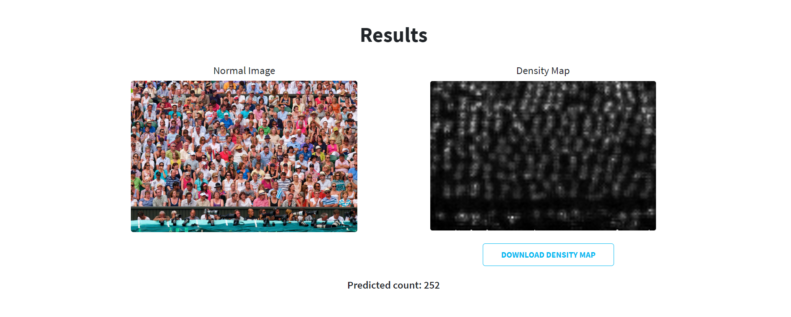

# Crowd-Computing-Using-CNN
This project provide simple webapp which is used to count number of people within images using CNN (vgg-16) Model.

Project Banner

Home Page :-

Upload Image:-

Result:-

Crowd-Computing-Using-CNN

📋 Table of Contents
🤖 Introduction
⚙️ Tech Stack
🔋 Features
🤸 Quick Start
🕸️ Snippets
🔗 Links
🚀 More

🤖 Introduction
=================
By developing this project, you will gain hands-on experience in:

Computer Vision and Deep Learning:
    Preprocessing images and utilizing Convolutional Neural Networks (CNNs), specifically the VGG-16 model.
    Understanding transfer learning for adapting pre-trained models.

Web Development:
    Creating a user-friendly interface for image upload and result visualization.
    Implementing backend logic to process images and communicate with the CNN model.

Integration and Deployment:
    Integrating the VGG-16 model into the web application.
    Deploying the application on a server or cloud platform for accessibility.

Model Evaluation and Fine-tuning:
    Evaluating model accuracy and efficiency using relevant metrics.
    Exploring fine-tuning techniques for performance improvement.

User Experience (UX) Design:
    Designing an intuitive interface for seamless user interaction.
    Implementing user feedback features for a positive experience.

Project Management:
    Breaking down tasks, creating timelines, and planning the development process.
    Using version control systems like Git for effective collaboration and codebase management.

⚙️ Steps :-

1. Clone Project:
    Begin by cloning the project repository to your local environment.
    
2. Review Project Documentation:
    Explore the provided resources: PPT, Video, Report, and Poster for a comprehensive understanding.

3. Model Exploration:
    Import the 'model' folder into Google Colab to delve into the code.
    Understand the intricacies and functionalities of the VGG-16 model implemented in the project.

4. Web Application Setup:
    Import the 'webapplication'; a Django-based web application designed to interact with the model.
    Dive into the codebase to comprehend the backend logic and frontend components.

5. Bonus Step:
    While not on the list, consider expressing your appreciation by giving the project a star if you find it valuable or enjoyable.

🚀 More

To elevate your portfolio and open doors to enhanced opportunities, I've crafted a 3D portfolio using React and Three.js. Take a look here: https://github.com/gopal031119/3d-portfolio.

